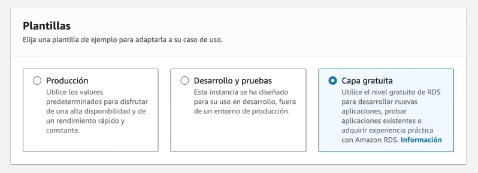

# Introducción a Amazon RDS

Amazon Relational Database Service (Amazon RDS) es un servicio administrado de bases de datos relacionales que facilita la configuración, operación y escalado de bases de datos en la nube.

## Características principales

- **Administración automática**: backups, actualizaciones, monitoreo y recuperación.
- **Alta disponibilidad**: mediante configuraciones Multi-AZ.
- **Escalabilidad**: capacidad para escalar verticalmente CPU, memoria y almacenamiento.
- **Seguridad**: integración con IAM, cifrado en reposo y en tránsito.
- **Compatibilidad**: soporta varios motores como:
  - Amazon Aurora
  - PostgreSQL
  - MySQL
  - MariaDB
  - Oracle
  - Microsoft SQL Server

## Casos de uso

- Aplicaciones web y móviles
- ERP y CRM

## Consideraciones al iniciar DB's de RDS

Seleccionar la capa gratuita para iniciar
