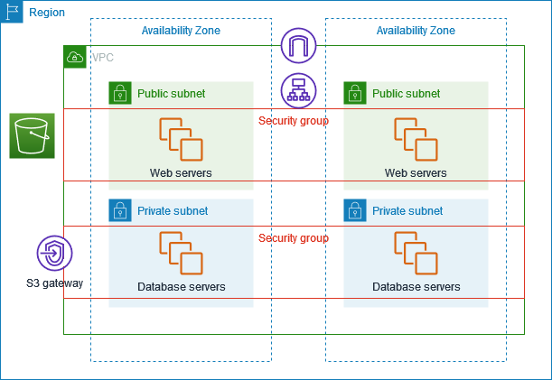

# Introducción a Amazon VPC

Amazon Virtual Private Cloud (Amazon VPC) permite lanzar recursos de AWS en una red virtual que tú defines, lo cual brinda control total sobre tu entorno de red.

## Características principales

- **Segmentación de red**: creación de subredes públicas y privadas.
- **Control del tráfico**: mediante tablas de rutas, gateways de internet y NAT.
- **Seguridad**: configuración de grupos de seguridad y listas de control de acceso (NACLs).
- **Conectividad híbrida**: mediante VPN, AWS Direct Connect o VPC peering.
- **Escalabilidad**: integración con servicios como EC2, RDS y Lambda dentro de la VPC.

## Componentes clave

- **Subredes**: Dividen la VPC en zonas de disponibilidad.
- **Route Tables**: Definen el enrutamiento del tráfico.
- **Internet Gateway**: Permite acceso a Internet.
- **NAT Gateway**: Permite que instancias en subredes privadas accedan a Internet sin estar expuestas.
- **Security Groups y NACLs**: Definen las reglas de entrada y salida del tráfico.

## Casos de uso

- Aislamiento de entornos (dev, qa, prod).
- Aplicaciones seguras con múltiples capas (web, app, base de datos).
- Conexión segura con centros de datos locales.